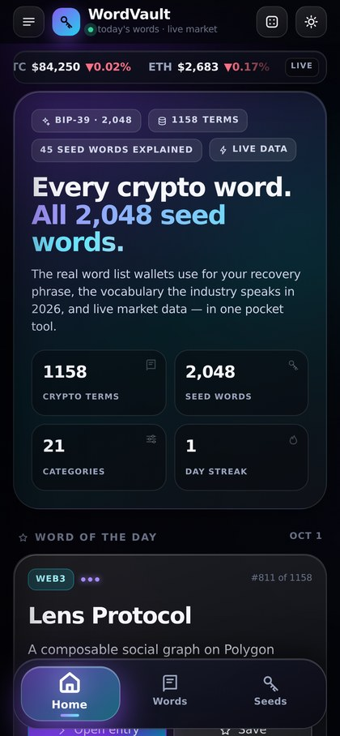
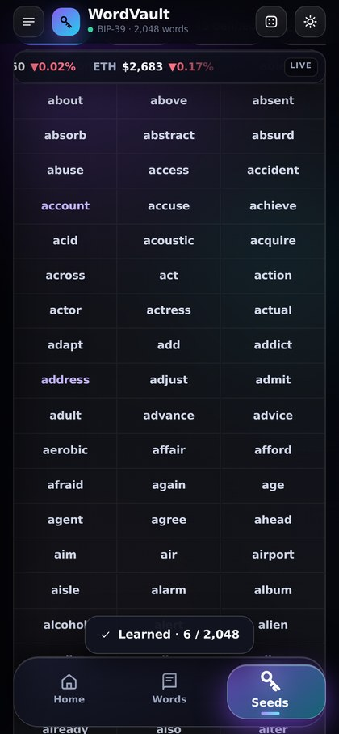
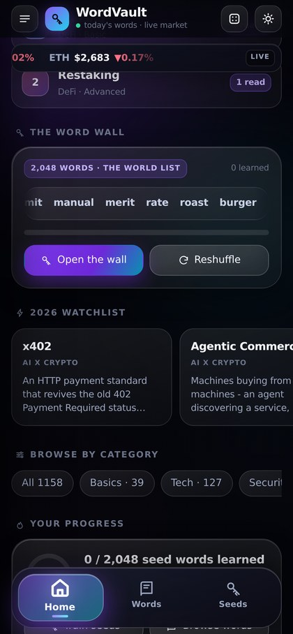
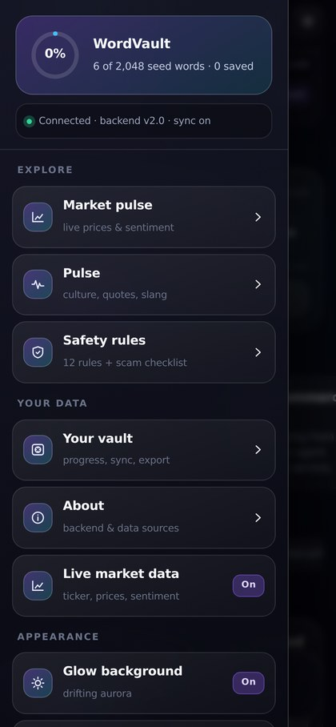

# WordVault

**Every crypto word. All 2,048 seed words. Live market data. One installable app.**

A pocket reference built for iPhone: a 1,158-entry crypto dictionary written for 2026, the
official **BIP-39 2,048-word list** rendered as a scrollable *word wall*, real trainers
(including a checksum validator that does the same maths inside your wallet), live prices —
and a small Python backend that ranks what people are actually reading.

No frameworks, no bundler, no dependencies. The app is **one self-contained HTML file** that
works with the network switched off.

<p align="center">
  
  
  
  
</p>

---

## What's inside

| | |
|---|---|
| **1,158 crypto terms** | 21 categories, three depth levels, searchable — 2026-current: GENIUS/CLARITY acts, x402 agent payments, restaking, prediction markets, RWA tokenisation, DVOL & gamma squeezes, Permit2, EMI rails, Nigerian P2P realities |
| **The real BIP-39 list** | All **2,048** words with position, alphabet neighbours and letter shape; 45 carry full dictionary entries |
| **The word wall** | Every seed word on one screen — 3-column wall, filters for *all / learned / defined*, instant search, tap any tile to open it |
| **Trainers** | Flashcards, real-word quiz with deliberate misspellings, definition quiz, phrase builder, and a **BIP-39 checksum validator** (passes the official test vectors) |
| **Live market** | Prices, 24h moves, 7-day sparklines, market cap, dominance, Fear & Greed — cached server-side so the UI never blanks |
| **Trending, for real** | Every word anyone opens is counted in the backend; the Home page ranks what people actually read — no invented numbers |
| **Progress that syncs** | Saved words, learned seed words, streak and quiz stats live on the device and in your own backend row, with JSON export/import |
| **Motion & glass** | Directional page transitions, reveal-on-scroll, count-up stats, red/green price flashes, sparkle bursts, and three bold glass tabs whose active tab lifts, scales and glows |
| **Offline for real** | Service-worker app shell + embedded dictionary and seed list. Airplane mode: every word, the wall, the trainers and phrase validation keep working |

## Run it

```bash
# the app alone — open the file, everything except live data works
open WordVault.html

# the app plus the backend (no pip installs, standard library only)
python3 server.py 8000          # http://localhost:8000   ·  docs at /api
```

Docker and Render are wired up too:

```bash
docker build -t wordvault . && docker run -p 8000:8000 -v wordvault-data:/data wordvault
```

* **GitHub Pages** serves `index.html`, so the repo URL is also a working app (offline library mode — prices and sync need the backend).
* **Render** — `render.yaml` is ready; the free plan is enough for the API.
* `PORT` and `WORDVAULT_DB` are read from the environment, so any host works.

## The API

```
GET  /api/health                 service status, counts, db + market state
GET  /api/meta                   full app payload (terms, seeds, quotes, rules)
GET  /api/stats                  counters, device count, trending
GET  /api/terms?q=&cat=&level=&offset=&limit=&sort=    ranked full-text search (SQLite FTS5)
GET  /api/terms/{name}           one entry (and one read counted for trending)
GET  /api/categories             category counts
GET  /api/random                 random entry
GET  /api/seeds?q=&offset=&limit=                      the 2,048 words
POST /api/seeds/validate         BIP-39 checksum validation (server-side SHA-256)
POST /api/seeds/generate         checksum-valid practice phrase
GET  /api/prices                 prices, sparklines, global stats, sentiment (cached 60s)
GET  /api/prices/history?coin=&days=
GET  /api/trending?limit=        most-read words from real usage (never cached)
GET  /api/quotes?cat=            quotes by category
GET  /api/rules                  self-custody rules
GET  /api/progress?uid=  POST  DELETE                  per-device progress sync
GET  /api/export?uid=            progress JSON download
POST /api/event                  anonymous counter; {"kind":"word_read","name":"Staking"} counts a read
```

## Tests

Two suites, both run in CI on every push (`.github/workflows/ci.yml`).

```bash
python3 tests/test_backend.py     # 65 checks, zero dependencies
python3 tests/e2e_ui.py           # 33 checks in a real browser (needs playwright)
```

`test_backend.py` boots its own server against a throw-away database and checks the build
integrity (2,048 unique BIP-39 words, no duplicate or stub entries), every endpoint, the
**official BIP-39 test vectors**, progress round-trips, the counters written to SQLite — and
that the committed HTML is the one the content produces.

`e2e_ui.py` drives an iPhone-profile browser through the real journey: the iOS no-zoom rule,
three tabs, the word wall, saving and learning words, trending filling up from *this session's*
reads on a cold database, the offline fallback, and a **total network blackout** that the
service worker survives. It fails on any console error.

## Project structure

```
WordVault.html            the built app (single file, also served as index.html)
server.py                 backend: REST API, FTS5 search, SQLite progress + usage counters
app/build.py              merges content -> one HTML file, the manifest and the service worker
app/tpl_head.html         design system: glass, icons, 21 keyframe animations, wall styles
app/tpl_body.html         markup for all eight views, three-tab bar, drawer, sheets
app/js1.js                state, network layer with offline fallback, router, dictionary, home
app/js2.js                seeds trainer, market, pulse, vault, safety, about
app/js3.js                motion engine: reveals, counters, flashes, sparkles, trending, word wall
app/data/terms*.py        the dictionary — one tuple per word
app/bip39.txt             the official BIP-39 word list
tests/                    backend suite + browser end-to-end suite
docs/screenshots/         the images in this README
tools/push.sh             push helper that never stores a token in the repo
```

## Adding a word

```python
# app/data/terms11.py
TERMS = [
    ("Your Term", "Category", "A real, useful explanation written for 2026.", 2,
     "An example sentence using it."),
]
```

`python3 app/build.py` → the HTML, the manifest, the service worker and
`WordVault-wordlist.md` (a printable A–Z companion) all regenerate, and the backend picks the
new entry up on restart (`/api/health` shows the count). CI fails if you forget to rebuild.

## Privacy

The app stores progress on the device and, when the backend is reachable, in your own row keyed
by a random device id. Usage counters are aggregate only (how many words were opened, how many
phrases validated). No accounts, no trackers, no third-party scripts. Market data comes from
CoinGecko with Kraken as fallback, sentiment from alternative.me.

## Disclaimer

Educational material only — not financial advice. **Never** generate, type or store a real
recovery phrase into any app, website or list, including this one. The phrase builder exists to
practise *recognising* and *checking* words; real wallets generate their own phrases on hardware
you control.

## License

MIT — see [LICENSE](LICENSE).
